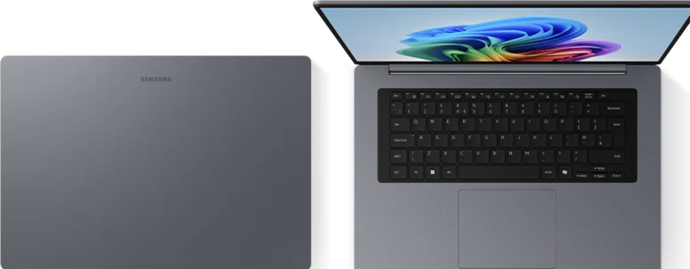
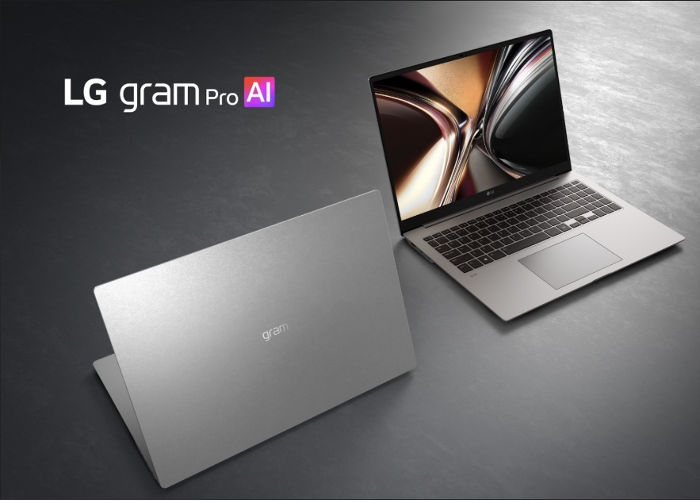
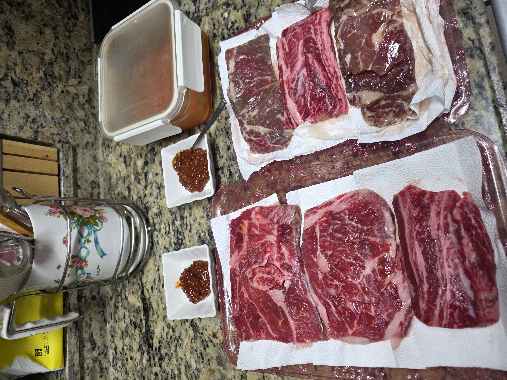
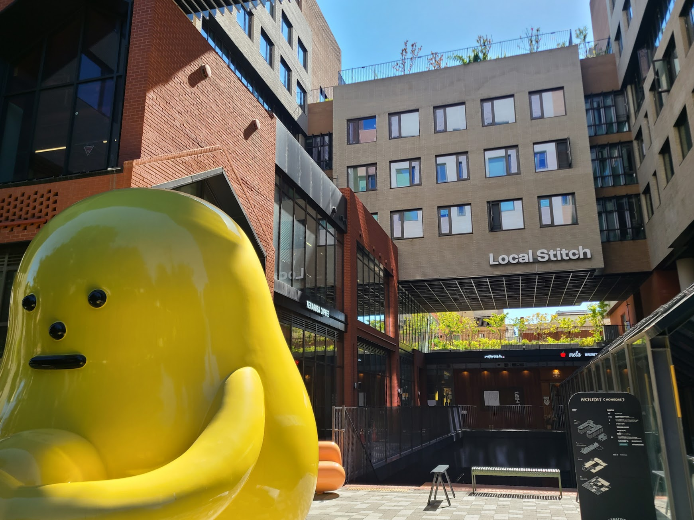

## 문제 1

Q: 다음 이미지에 대한 설명 중 옳지 않은 것은 무엇인가요?  
- (1) 많은 사람들이 노트북을 사용하고 있는 모습이 보입니다.
- (2) 벽에는 'DIVE 2024 IN BUSAN'이라는 글자가 보입니다.
- (3) 참가자들이 체육관에서 운동을 하고 있습니다.
- (4) 천장에 조명기구가 설치되어 있습니다.

정답: (3) 참가자들이 체육관에서 운동을 하고 있는 것이 아니라 회의실에서 행사를 참여하고 있습니다.

------------------------

## 문제 2

Q: 다음 이미지에 대한 설명 중 옳지 않은 것은 무엇인가요?
- (1) 노트북 뚜껑에 브랜드 로고가 있습니다.
- (2) 모니터 화면에 컬러풀한 이미지가 표시되어 있습니다.
- (3) 키보드는 하얀색입니다.
- (4) 노트북은 한쪽에 배치된 이미지로 보입니다.

정답: (3) 키보드는 검은색입니다.

------------------------

## 문제 3

Q: 다음 이미지에 대한 설명 중 옳지 않은 것은 무엇인가요?
- (1) 노트북에 "gram"이라는 로고가 있습니다.
- (2) 노트북 화면에 자연 풍경 사진이 표시되어 있습니다.
- (3) 노트북은 두 개의 서로 다른 각도로 놓여 있습니다.
- (4) "LG gram Pro AI"라는 문구가 이미지에 포함되어 있습니다.

정답: (2) 노트북 화면에 자연 풍경 사진이 아닌 다른 이미지가 표시되어 있습니다.

------------------------

## 문제 4

Q: 다음 이미지에 대한 설명 중 옳지 않은 것은 무엇인가요?
- (1) 여러 조각의 고기가 종이 타월 위에 놓여 있습니다.
- (2) 두 개의 작은 접시에는 소스가 담겨 있습니다.
- (3) 오른쪽 상단에는 투명한 뚜껑이 덮인 용기가 있습니다.
- (4) 배경의 주방 조리 도구는 검은색입니다.

정답: (4) 배경의 주방 조리 도구는 검은색이 아닌 다른 색입니다.

------------------------

## 문제 5

Q: 다음 이미지에 대한 설명 중 옳지 않은 것은 무엇인가요?
- (1) 노란색 조형물이 있습니다.
- (2) 건물에 "Local Stitch"라는 글자가 있습니다.
- (3) 빨간색 벽돌 건물이 보입니다.
- (4) 조형물은 파란색입니다.

정답: (4) 조형물은 노란색이지 파란색이 아닙니다.

------------------------

